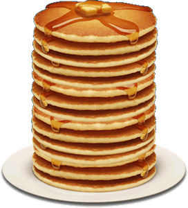

## Introduction
When we talk about stacks, it's useful to think of a stack of pancakes.  Stacks work by a "Last In, First Out" or LIFO system.  When you make pancakes, as they finish, you throw them onto a plate.  The most recent ones that have finished cooking will end up on top of the stack.  The same principle is true in programming.  

## Functions
In general, the stack has four particularly useful functions, those being *Push*, *Pop*, *Peek*, and *isEmpty*, in addition to the standart functions useable for lists